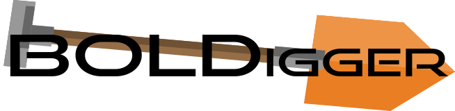

# BOLDigger

Python program to query .fasta files against the different databases of www.boldsystems.org

## Introduction
DNA metabarcoding data sets often consist of hundreds of Operational Taxonomic Units (OTUs), which need to be queried against databases to assign taxonomy. Barcode of Life Data system (BOLD) offers such a database that is used by many biologists. Unfortunately, only batches of 100 sequences can be identified once. Using BOLD's API does not solve the problem completely since it does not grant access to private and early release data. BOLDigger aims to solve this problem. As a pure python program with a user-friendly GUI, it not only gives automated access to the identification engine but can also be used to download additional metadata for each sequence as well as helping to choose the top hit from the returned results.

For the command-line version please visit https://github.com/DominikBuchner/BOLDigger-commandline

## Installation

BOLDigger requires Python version 3.6 or higher and can be easily installed by using pip in any command line:  

`pip install boldigger`  

will install BOLDigger as well as all needed dependencies.
BOLDigger can be started by typing:  

`boldigger` or `python -m boldigger`

When a new version is released you can update by typing:

`pip install --upgrade boldigger`

## How to cite

Buchner D, Leese F (2020) BOLDigger – a Python package to identify and organise sequences with the Barcode of Life Data systems. Metabarcoding and Metagenomics 4: e53535. https://doi.org/10.3897/mbmg.4.53535

## Login to your account

The identification engine requires an account at www.boldsystems.org. A login is required to query more than one sequence with the identification engine. User data can be saved by ticking "Remember me". **Note that your password will be saved unencrypted. Don't use this option if this is not okay.**  
Only one login per session is required.

## Use the BOLD identification engine for COI, ITS, and rbcL & matK

Once logged into the account, the identification engine of BOLD can be used. An output folder needs to be selected where the results will be saved, as well as an input file in .fasta format. Three different databases can be selected: **COI, ITS, or rbcL & matK** as well as a **batch size**. The latter handles how many sequences will be identified in one request. 100 is the maximum value as and the default for COI. Batch size depends on various parameters such as internet connection, availability of the BOLD database as well as the length of the requested sequences and needs to be adjusted if a lot of ConnectionErrors occur. A batch size of **100 is recommended for COI**, **10 for ITS**, and **< 5 for rbcL & matK.**  
The results will be written to the output folder and will always be named "BOLDResults_fastaname.xlsx". In case a workbook with that name already exists in the output folder the results will be appended to this file.   
After every batch, the requested sequences will be removed from the input file and written to a new file named "fastaname_done.fasta" in the same folder as the input file. This is to prevent running input files twice: If BOLDigger crashes it can just be restarted with the same output folder and input file and will continue where the crash occurred.

**The BOLD server will take some time to respond to the request. The output window will freeze during this time and updated once a response is sent.**  
**Please make sure there are no additional empty lines or invalid sequences (containing letters that don't code for bases) in your .fasta file.**

Test input files can be found [here](https://github.com/DominikBuchner/BOLDigger/tree/master/tests)

## Download additional data from BOLD

The standard output of the identification engine returns information about the taxonomy (Phylum, Class, Order, Family, Genus, Species and Subspecies) as well as a similarity score for each hit in the database, if the data is public, private or early-access as well as the BOLD Process ID.  
Additional data can be downloaded via the BOLD API by providing the output of the identification engine. Additional data are BOLD Record ID, BOLD BIN, Sex, Life stage, Country, Identifier, Identification method, the institution storing the sample, and a link to the specimen page. Note that in order to open the specimen page login to boldsystems.org is required.

## Find the best fitting hit from the top 20 (COI) and top 99 (ITS / rbcL & matK)

There are three options available to determine the best fitting hit:  
* First hit
* JAMP Pipeline
* BOLDigger

### First hit

This option uses the first hit and can be used for all markers supported by BOLDigger.

### JAMP Pipeline

This option reproduces the output from the [JAMP Pipeline](https://github.com/VascoElbrecht/JAMP). Therefore different thresholds (98%: species level, 95%: genus level, 90%: family level, 85%: order level, <85%: class level) for the taxonomic levels are used to find the best fitting hit.  
After determining the threshold for all hits the most common hit above the threshold will be selected. Note that for all hits below the threshold the taxonomic resolution will be adjusted accordingly (e.g. for a 96% hit the species level information will be discarded and genus level information will be used as the lowest taxonomic level).

### BOLDigger - requires additional data

This option is similar to the JAMP option but flags suspicious hits. **Make sure additional data was downloaded.**
There are currently 4 flags implemented, which will be updated if needed:

1. Reverse BIN taxonomy has been used for any of the top 20 hits representing the selected match. (Reverse BIN taxonomy: Deposited sequences on BOLD that lack species information may be assigned by BIN affiliation. By that, a species name is shown for deposited sequences eben when no morphological identification down to species level was carried out.)

2. There are two or more entries with differing taxonomic information above the selected threshold. (e.g. two species above 98%). Note that this is sometimes the case due to deposited sequences bearing invalid epitheton information such as "sp." or even a blank entry.

3. All of the top 20 hits representing the top hit are private or early-release hits.

4. The top hit result represents a unique hit of the top 20 hits.

A closer look at all flagged hits is advised since they represent a certain degree of uncertainty for the selected hit.

## Still to do

* Implement the identification engine API for quick analyses
* Add a failsafe for long sequence names which crash the identification engine
